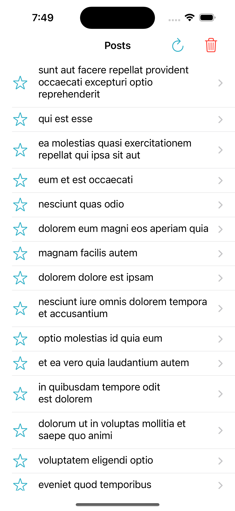
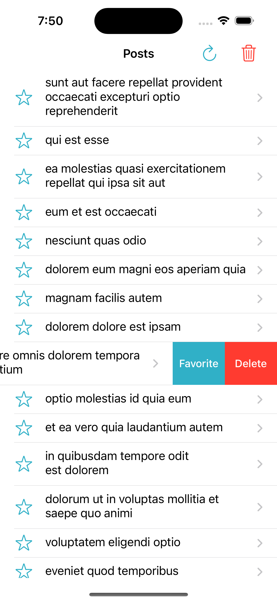
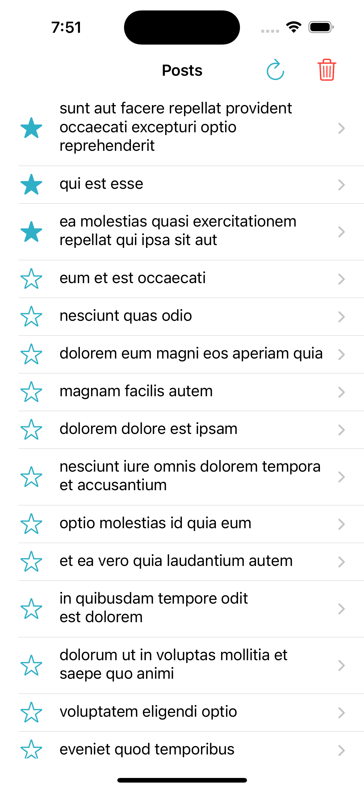
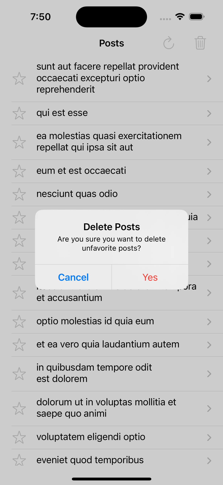
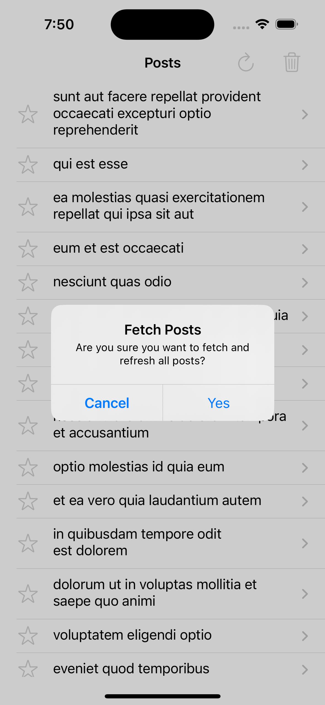
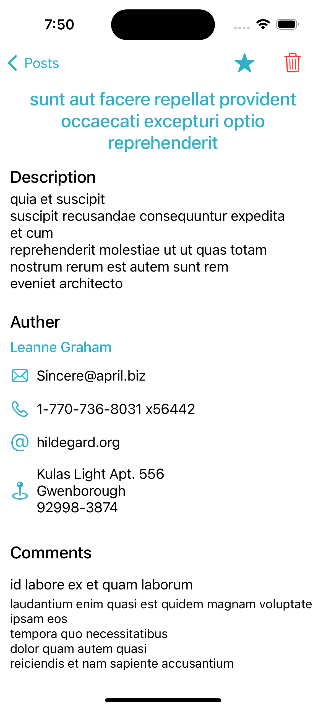

# JSONPlaceholder iOS App

This is a sample iOS project that displays a list of posts and their details from JSONPlaceholder API using MVVM architecture.


# Getting Started

These instructions will get you a copy of the project up and running on your local machine for development and testing purposes.

## Prerequisites

- Xcode 14.2 or later
- Swift 5

## Installing

1. Clone the repository
```bash
git clone https://github.com/rahulpatel-langara/to-jsonplaceholder.git
```
2. Open the project in Xcode
3. Build and run the project

## Functionalities

✅ Loads the posts from the JSON API and populate the view.  
✅ Each cell/row shows the post's title without clipping (dynamic height).  
✅ Once a Post is selected, it opens Post Details Screen.  
✅ The post details screen contains 	  
	&nbsp;&nbsp;&nbsp;&nbsp;&nbsp;&nbsp;✅ The post title and description.  	  
	&nbsp;&nbsp;&nbsp;&nbsp;&nbsp;&nbsp;✅ The post author information.  	  
	&nbsp;&nbsp;&nbsp;&nbsp;&nbsp;&nbsp;✅ The list of comments.  
✅ Mechanism to favorite/unfavorite a post  	  
	&nbsp;&nbsp;&nbsp;&nbsp;&nbsp;&nbsp;✅ Favorite posts display at the top of the list.  	 
	&nbsp;&nbsp;&nbsp;&nbsp;&nbsp;&nbsp;✅ Favorite posts have a star indicator.  
✅ Mechanism to delete a post.  
✅ Mechanism to remove all posts except the favorites ones.  
✅ Mechanism to load all posts from the API.  
✅ Unit Tests.  
✅ Supports iOS 15+ and developed using UIKit.  

## Screenshots
&nbsp;&nbsp;&nbsp;
  &nbsp;&nbsp;&nbsp;
  &nbsp;&nbsp;&nbsp;
  &nbsp;&nbsp;&nbsp;
  &nbsp;&nbsp;&nbsp;
  


## Acknowledgments

-   [JSONPlaceholder](https://jsonplaceholder.typicode.com/) - The API used for the project.
